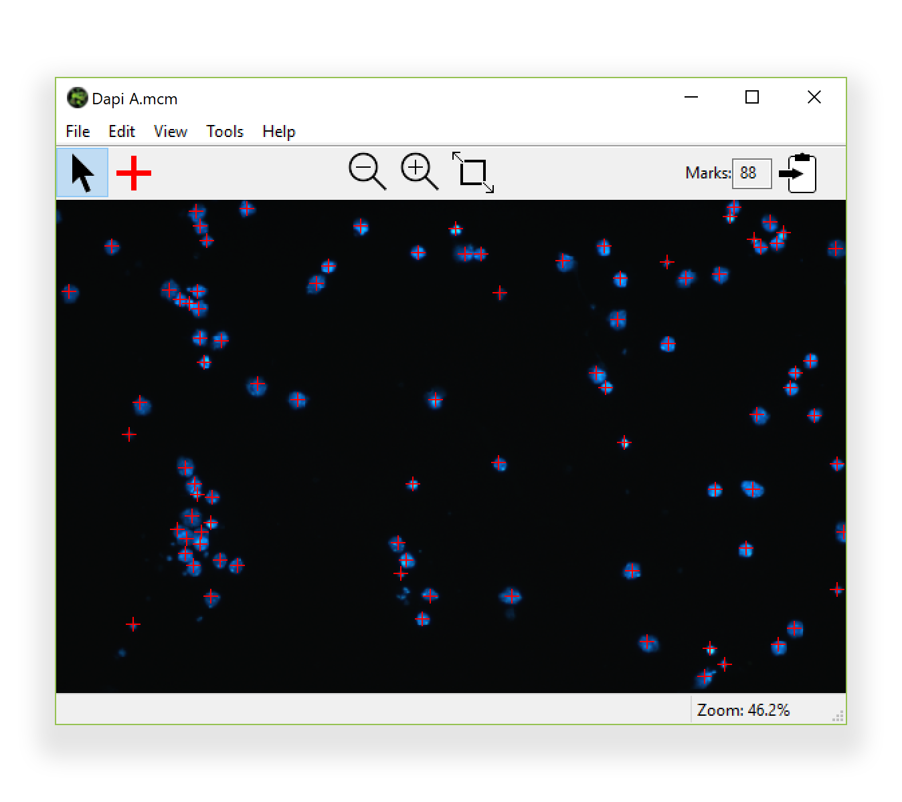

---
# Feel free to add content and custom Front Matter to this file.
# To modify the layout, see https://jekyllrb.com/docs/themes/#overriding-theme-defaults

layout: default
title: Marcam
---
# Summary

Marcam is an application for macOS and Windows that allows you to mark
objects in an image, and keep track of how many marks have been made.  In
addition, it allows you to make other key image modifications.

### Features

* Temporary zoom by pressing and holding space bar for detail work
* Manual marking of objects/locations in the image
* Total count of marks
* Basic image processing
  * Auto-contrast
  * Brightness / Color Inversion (B&W or Color Negative)
  * False color of Grayscale images

### Future
* Automated object marking

# Downloads

### Latest Release -- 2018 Aug 25
[Marcam 0.8 (macOS)](https://github.com/itsayellow/marcam/releases/download/v0.8/Marcam.0.8.Mac.dmg)

[Marcam 0.8 (Windows)](https://github.com/itsayellow/marcam/releases/download/v0.8/Marcam.0.8.Windows.Installer.exe)

### All Releases
[Marcam Github Releases](https://github.com/itsayellow/marcam/releases)

# Screenshots

### Mac Screenshot

### Windows Screenshot

# Documentation

You can also access this help from the Help&rarr;Marcam Help menu inside of Marcam.

* [Marcam macOS Documentation](documentation_mac)
* [Marcam Windows Documentation](documentation_win)

# System Requirements
* Mac OS X 10.10 Yosemite or later.
* Windows 10
